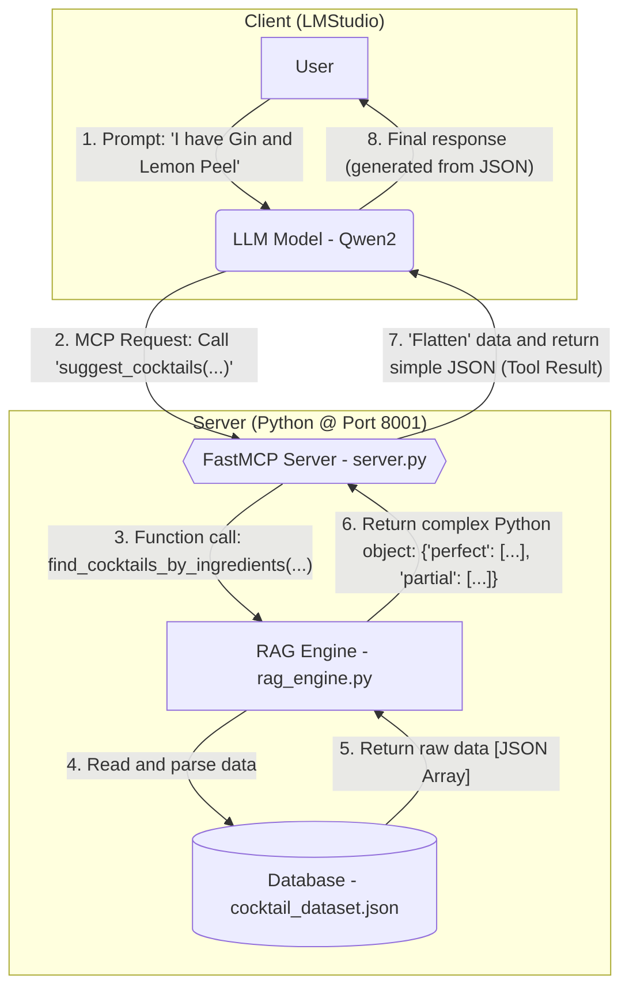
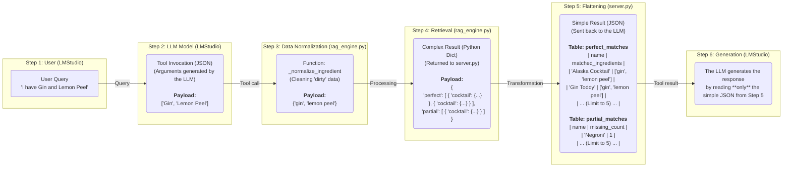

# 🍸 RAG Cocktail Assistant (FastMCP + LMStudio)

<p align="center">
  <strong>Advanced Retrieval-Augmented Generation (RAG) system for serving precise cocktail recipes to LLMs.</strong>
</p>

<p align="center">
<a href="https://github.com/modelcontext/fastmcp">
    
</a>
<a href="https://lmstudio.ai/">
    
</a>
<a href="https://www.python.org/">
    
</a>
</p>


## 1. About the Project

This project is an implementation of the **RAG (Retrieval-Augmented Generation)** architecture. Its goal is to create an external "tools" system that connects a language model (LLM) with a dedicated, static knowledge base.

Instead of relying on the model’s general internal knowledge, this system ensures that responses are **verifiable** and **fact-based** using the provided dataset.

This project demonstrates:
* Implementation of an **MCP (Model Context Protocol)** server using **FastMCP**.
* Construction of a custom search engine (retriever) in Python, capable of handling inconsistent data.
* Integration of the RAG server with the **LMStudio** client to provide the LLM (e.g., `qwen2`) with new, dynamic capabilities.

<br>

## 2. Key Technologies (Concept Explanation)

Before moving on to the architecture, it’s worth explaining the three key technologies this project is built upon.

### 🧠 What is RAG (Retrieval-Augmented Generation)?

**RAG** stands for **Retrieval-Augmented Generation**, which can be understood as “Generation Enhanced by Retrieval.”

* **The Problem:** LLMs (like Qwen2 or Llama) often *hallucinate* or make up answers when they don’t know the facts. Their knowledge is limited to the data they were trained on.
* **The Solution (RAG):** Instead of relying on the model’s internal memory, RAG gives it a “textbook” (in our case, the `cocktail_dataset.json` file) and instructs it to consult it every time it answers a question.

It works like an **open-book exam**:
1. **Retrieval:** The user asks for a recipe. Our code (`rag_engine.py`) first **retrieves** the correct recipe from our JSON file.
2. **Augmentation:** The system **augments** the model’s context by adding the retrieved recipe to its prompt.
3. **Generation:** The LLM receives a simple instruction: “Based on *these* provided data, generate a nice answer for the user.”

As a result, the model doesn’t fabricate — it relies on factual information.

### 📞 What is MCP (Model Context Protocol)?

**MCP** is a “language” or “phone line” that allows an LLM to communicate with our Python code.

* **The Problem:** The LLM (running in LMStudio) and our retrieval engine (`rag_engine.py`) are two separate programs. They need a way to talk to each other.
* **The Solution (MCP):** MCP is a protocol that standardizes this communication.
    * Our `server.py` (built using **FastMCP**) acts like a “kitchen” or a phone switchboard, waiting for orders on port 8001.
    * When the LLM wants to find something, it uses MCP to “call” our server and place an “order” (e.g., “please use the `get_cocktail_recipe` tool for ‘Mojito’”).
    * Our server receives the request, runs `rag_engine.py`, and sends the data back.

### 🖥️ What is LMStudio?

**LMStudio** is a free desktop application that allows anyone to download and run powerful LLMs (like those from Meta, Google, or Mistral) locally on their own computer.

In our project, LMStudio serves **two key roles**:
1.  **Model Host:** It’s the “home” of the LLM (e.g., `qwen2`), which acts as the “brain” of the entire operation.
2.  **MCP Client:** It functions as the “phone” that uses the MCP protocol to connect to the server and access the tools we’ve provided.

<br>

## 3. System Architecture (Flow Diagram)

The diagram below illustrates how information flows through the system — from the user’s query to the final response.





## 4. Data Architecture: The Journey of a Single Query

To better understand how the system processes data, let’s trace the journey of the query **"I have Gin and Lemon Peel"** through the entire architecture.

### Step 1: User Query (Raw Text)
The user types in LMStudio:

```
I have Gin and Lemon Peel
```

### Step 2: Tool Invocation (JSON from LLM to Server)
The LLM (`qwen2`) recognizes that it needs to use a tool. It parses the user’s query into JSON format and sends it to our `server.py` server:
```json
{
  "ingredients": ["Gin", "Lemon Peel"]
}
```

### Step 3: Data Normalization (in rag_engine.py)
Our RAG engine receives this JSON. The function (`_normalize_ingredient`) immediately cleans the data to handle a “messy” database.

| Input Data (from LLM) | After Normalization (in Python) | Explanation |
|:---|:---|:---|
| "Gin" | "gin" | Standardization (lowercase) |
| "Lemon Peel" | "lemon peel" | **Key step:** Differentiation from juice ("lemon") |

Resulting search set: (`{'gin', 'lemon peel'}`)

### Step 4: Retrieval and "Flattening" (in server.py)
Our `rag_engine.py` finds all matching cocktails and returns them to `server.py` as a complex object. Then, `server.py` flattens this data to prepare a simple response for the LLM.

### Step 5: Tool Result (Final JSON Sent to LLM)
The LLM doesn’t receive a complicated nested object. Instead, `server.py` sends it a simple, “flattened” JSON that’s easy to read:

```json
{
  "status": "success",
  "type": "suggestion_by_ingredient",
  "perfect_matches": [ ... ],
  "partial_matches": [ ... ]
}
```

The key lists (`perfect_matches`) and (`partial_matches`) inside this JSON can be visualized as the following tables:

**Table: perfect_matches (Data sent to LLM)**  
(Cocktails found that contain both ingredients: "gin" and "lemon peel")

| Name | Matched Ingredients | Full Ingredient List (all ingredients in recipe) |
|:-------------|:------------------------------------------|:---------------------------------------------------|
| Alaska | ['gin', 'lemon peel'] | ["1 1/2 oz Gin", "Twist of Lemon Peel", ...] |
| Gin Toddy | ['gin', 'lemon peel'] | ["2 oz Gin", "1 twist of Lemon Peel", ...] |
| Bermuda | ['gin', 'lemon peel'] | ["3/4 oz Gin", "3/4 oz Brandy", "Lemon Peel", ...] |
| ... (Limit to 5) | ... | ... |

**Table: partial_matches (Data sent to LLM)**  
(Cocktails found that contain only one of the ingredients)

| Name | Matched Ingredients | Missing Ingredients Count |
|:-------------|:------------------------------------------|:---------------------------------------------------------:|
| Negroni | ['gin'] | 1 |
| Gin And Tonic | ['gin'] | 1 |
| Whiskey Sour | ['lemon'] | 1 |
| ... (Limit to 5) | ... | ... |

### Step 6: Response Generation (Raw Text)
The LLM receives simple, tabular data from Step 5. According to the System Prompt, its task is only to read and present it:

```
"Based on the ingredients you have, here are some cocktail suggestions:

Alaska Cocktail (Matched Ingredients: gin, lemon peel)

Gin Toddy (Matched Ingredients: gin, lemon peel)

...

You can also consider the following partial matches (missing 1 ingredient):

Negroni"
```


---

## 5. Run Instructions (Step by Step)

### Step 1: Download and Installation

To run the project, first clone this repository to your local computer and install the required dependencies.

```bash
# 1. Clone the repository
git clone https://github.com/xVarmondx/fastmcp-cocktail-rag

# 2. Enter the project folder
cd fastmcp-cocktail-rag

# 3. (Recommended) Create a virtual environment
python -m venv .venv

4. Active virtual enviroment
#    On Windows:
.venv\Scripts\activate
#    On macOS/Linux:
source .venv/bin/activate

# 5. Install dependencies
pip install "fastmcp[http]"
```

### Step 2: Running the RAG Server (Python)

Make sure your `cocktail_dataset.json` file is located at the path specified in `server.py` (default: `dataset/cocktail_dataset.json`).

In the terminal, with the `.venv` environment activated, run the server:

```bash
python server.py
```

The server will start on port 8001.  
If everything went well, you should see a confirmation in the console that the database has been loaded:

```
Successfully loaded 134 cocktails from dataset/cocktail_dataset.json
Starting FastMCP Cocktail RAG server...
...
Server started.
```

Do not close this terminal.

### Step 3: Client Configuration (LMStudio)
Now that our RAG server is running, we need to configure LMStudio to communicate with it.

1. Launch LMStudio.  
2. Go to the **Discover** tab (magnifying glass icon) on the left sidebar.  
3. Search for and download the model: (`qwen2-vl-7b-instruct`) (7.39 GB).  
4. Open the **Chat** tab on the left side, then on the right panel go to **Program → Install → Edit mcp.json**.  
   Set up the connection to the server.

```json
{
  "mcpServers": {
    "CocktailRAGAssistant": {
      "url": "http://127.0.0.1:8001/mcp"
    }
  }
}
```

And click (`Save`).

5. Go to the **Developer** tab and start the LMStudio chat server by clicking **Start Server** at the top.  
6. Open the **Chat** tab, create a new chat (+), and enter a query:

---

## 6. Example Tests (How to Check if It Works)

After completing all the steps above, the system is ready to use. Below is a set of test queries you can ask in LMStudio to verify each of the three main RAG functionalities.

### A. Test: Questions About Cocktails and Their Ingredients
*Tool: `get_cocktail_recipe`*

These prompts test whether the system can find a specific recipe in the `cocktail_dataset.json` database.

**Test 1: Recipe Query (Success)**
```
What is the recipe for an Apricot Lady?
```

* **Expected result:** The model correctly calls the tool and returns the recipe for `Apricot Lady`.

**Test 2: Query for a recipe that does not exist in the database**

```
I'd like the recipe for a Cosmopolitan.
```

* **Expected result:** The model correctly determines that the recipe was not found (since it’s not in the JSON file), instead of making one up.

---

### B. Test: Suggestions Based on Ingredients
*Tool: `suggest_cocktails_by_ingredients`*

These prompts test the `_normalize_ingredient` logic in `rag_engine.py` and the system’s ability to handle inconsistent data.

**Test 3: Synonym Grouping (Lemon vs Lemon Juice)**

```
I have Gin and Lemon Juice. What can I make?
```

* **Expected result:** The system should find cocktails containing both `"lemon"` (e.g., `Long Island Tea`) and `"lemon juice"` (e.g., `Gin Sour`).

**Test 4: Ingredient Differentiation (Lemon vs Lemon Peel)**

```
I have Gin and Lemon Peel. What can I make?
```

* **Expected result:** The system **should NOT** display `Long Island Tea`. It should correctly return cocktails that actually contain `"Lemon Peel"` (e.g., `Alaska Cocktail` or `Gin Toddy`).

---

### C. Test: Suggestions Based on Flavor Preferences
*Tool: `suggest_cocktails_by_preference`*

These prompts test tag-based filtering.

**Test 5: Tag Filtering (Success - "AND" Logic)**

```
Suggest a cocktail that is "IBA" and "Classic".
```

* **Expected result:** The model will display a list including `Old Fashioned`, `Negroni`, and `Dry Martini`.

**Test 6: Tag Filtering (Error Handling / `null`)**

```
I want something that is "Vegan" and "Savory".
```
* **Expected result:** The system will not crash (thanks to `null` tag handling). The model will correctly determine that nothing was found, since no cocktail in the database has both of those tags simultaneously (`Mojito` is "Vegan", `Old Fashioned` is "Savory").


