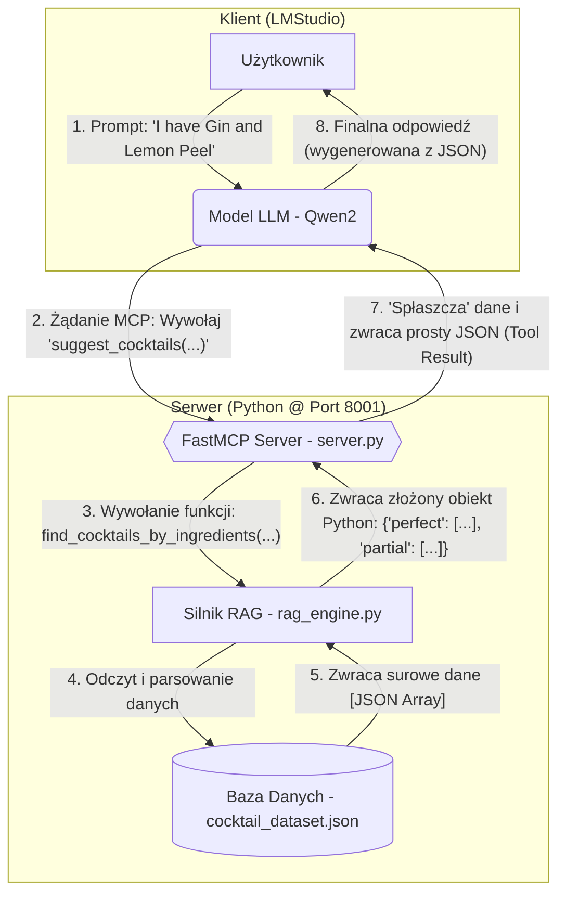
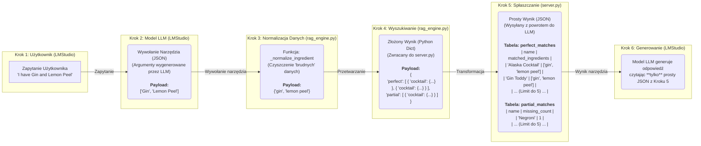

# 🍸 Asystent Koktajli RAG (FastMCP + LMStudio)

<p align="center">
  <strong>Zaawansowany system RAG (Retrieval-Augmented Generation) do serwowania precyzyjnych przepisów na koktajle dla modeli LLM.</strong>
</p>

<p align="center">
<a href="https://github.com/modelcontext/fastmcp">
    
</a>
<a href="https://lmstudio.ai/">
    
</a>
<a href="https://www.python.org/">
    
</a>
</p>

## 1. O Projekcie

Ten projekt to implementacja architektury **RAG (Retrieval-Augmented Generation)**. Jego celem jest stworzenie zewnętrznego systemu "narzędzi" (tools), który łączy model językowy (LLM) z dedykowaną, statyczną bazą wiedzy.

Zamiast polegać na ogólnej, wewnętrznej wiedzy modelu, system ten zapewnia, że odpowiedzi są **weryfikowalne** i **oparte na faktach** z dostarczonego zbioru danych.

Projekt ten demonstruje:
* Implementację serwera **MCP (Model Context Protocol)** przy użyciu **FastMCP**.
* Budowę niestandardowego silnika wyszukiwania (retrievera) w Pythonie, zdolnego do obsługi niekonsekwentnych danych.
* Integrację serwera RAG z klientem **LMStudio**, aby udostępnić modelowi LLM (np. `qwen2`) nowe, dynamiczne możliwości.

<br>

## 2. Kluczowe Technologie (Wyjaśnienie Koncepcji)

Zanim przejdziemy do architektury, warto wyjaśnić trzy kluczowe technologie, na których opiera się ten projekt.

### 🧠 Czym jest RAG (Retrieval-Augmented Generation)?

**RAG** to skrót od **Retrieval-Augmented Generation**, co można przetłumaczyć jako "Generowanie Wzbogacone o Wyszukiwanie".

* **Problem:** Modele LLM (jak Qwen2 czy Llama) często "halucynują" lub zmyślają odpowiedzi, gdy nie znają faktów. Ich wiedza jest ograniczona do danych, na których je trenowano.
* **Rozwiązanie (RAG):** Zamiast polegać na pamięci modelu, RAG daje mu "podręcznik" (w naszym przypadku plik `cocktail_dataset.json`) i każe mu z niego korzystać za każdym razem, gdy odpowiada na pytanie.

To działa jak **egzamin z otwartą książką**:
1.  **Retrieval (Wyszukiwanie):** Użytkownik pyta o przepis. Nasz kod (`rag_engine.py`) najpierw **wyszukuje** (pobiera) prawdziwy przepis z naszego pliku JSON.
2.  **Augmentation (Wzbogacanie):** System "wzbogaca" kontekst modelu, dodając do jego polecenia znaleziony przepis.
3.  **Generation (Generowanie):** Model LLM dostaje proste polecenie: "Na podstawie *tych* danych, które ci dałem, wygeneruj ładną odpowiedź dla użytkownika".

Dzięki temu model nie zmyśla, lecz opiera się na faktach.

### 📞 Czym jest MCP (Model Context Protocol)?

**MCP** to "język" lub "linia telefoniczna", która pozwala modelowi LLM rozmawiać z naszym kodem w Pythonie.

* **Problem:** Model LLM (działający w LMStudio) i nasz silnik wyszukiwania (`rag_engine.py`) to dwa oddzielne programy. Muszą mieć sposób, by się ze sobą komunikować.
* **Rozwiązanie (MCP):** MCP to protokół, który standaryzuje tę komunikację.
    * Nasz `server.py` (napisany przy użyciu **FastMCP**) działa jak "kuchnia" lub centrala telefoniczna, która czeka na zamówienia na porcie 8001.
    * Gdy model LLM chce coś znaleźć, używa MCP, by "zadzwonić" do naszego serwera i złożyć "zamówienie" (np. "proszę, użyj narzędzia `get_cocktail_recipe` dla 'Mojito'").
    * Nasz serwer odbiera to, uruchamia `rag_engine.py` i odsyła dane.

### 🖥️ Czym jest LMStudio?

**LMStudio** to darmowa aplikacja na komputery stacjonarne, która pozwala każdemu pobierać i uruchamiać potężne modele LLM (jak te od Mety, Google czy Mistral) lokalnie, na własnym komputerze.

W naszym projekcie LMStudio pełni **dwie kluczowe role**:
1.  **Host Modelu:** Jest "domem" dla modelu LLM (np. `qwen2`), który jest "mózgiem" całej operacji.
2.  **Klient MCP:** Działa jako "telefon", który używa protokołu MCP do łączenia się z serwerem i korzystania z narzędzi, które mu udostępniliśmy.

<br >

## 3. Architektura Systemu (Diagram Przepływu)

Poniższy diagram ilustruje, jak informacja przepływa przez system, od zapytania użytkownika do finalnej odpowiedzi.





## 4. Architektura Danych: Podróż Jednego Zapytania

Aby najlepiej zrozumieć, jak system przetwarza dane, prześledźmy podróż zapytania **"I have Gin and Lemon Peel"** przez całą architekturę.

### Krok 1: Zapytanie Użytkownika (Surowy Tekst)
Użytkownik wpisuje w LMStudio:

```
I have Gin and Lemon Peel
```

### Krok 2: Wywołanie Narzędzia (JSON od LLM do Serwera)
Model LLM (`qwen2`) rozpoznaje, że musi użyć narzędzia. Parsuje zapytanie użytkownika do formatu JSON i wysyła je do naszego serwera `server.py`:
```json
{
  "ingredients": ["Gin", "Lemon Peel"]
}
```

### Krok 3: Normalizacja Danych (w rag_engine.py)
Nasz silnik RAG odbiera ten JSON. Funkcja (`_normalize_ingredient`) natychmiast czyści dane, aby poradzić sobie z "brudną" bazą danych

| Dane Wejściowe (z LLM) | Po Normalizacji (w Pythonie) | Uzasadnienie |
|:---|:---|:---|
| "Gin" | "gin" | Standardyzacja (małe litery) |
| "Lemon Peel" | "lemon peel" | **Kluczowy krok:** Rozróżnienie od soku ("lemon") |


Wynikowy zestaw do wyszukania: (`{'gin', 'lemon peel'}`)

### Krok 4: Wyszukiwanie i "Spłaszczanie" (w server.py)
Nasz rag_engine.py znajduje wszystkie pasujące koktajle i zwraca je do server.py jako złożony obiekt. server.py następnie spłaszcza te dane, aby przygotować prostą odpowiedź dla modelu LLM.

### Krok 5: Wynik Narzędzia (Finalny JSON wysłany do LLM)
Model LLM nie otrzymuje skomplikowanego, zagnieżdżonego obiektu. Zamiast tego, server.py wysyła mu ten prosty, "spłaszczony" JSON, który jest łatwy do odczytania:

```json
{
  "status": "success",
  "type": "suggestion_by_ingredient",
  "perfect_matches": [ ... ],
  "partial_matches": [ ... ]
}
```

Kluczowe listy (`perfect_matches`) i (`partial_matches`) wewnątrz tego JSON-a można zwizualizować jako te tabele:


Tabela: perfect_matches (Dane wysłane do LLM)
(Znaleziono koktajle, które mają oba składniki: "gin" i "lemon peel")

| Nazwa (name) | Dopasowane Składniki (matched ingredients) | Pełna Lista Składników (all ingredients in recipe) |
|:-------------|:------------------------------------------|:---------------------------------------------------|
| Alaska | ['gin', 'lemon peel'] | ["1 1/2 oz Gin", "Twist of Lemon Peel", ...] |
| Gin Toddy | ['gin', 'lemon peel'] | ["2 oz Gin", "1 twist of Lemon Peel", ...] |
| Bermuda | ['gin', 'lemon peel'] | ["3/4 oz Gin", "3/4 oz Brandy", "Lemon Peel", ...] |
| ... (Limit do 5) | ... | ... |

Tabela: partial_matches (Dane wysłane do LLM)
(Znaleziono koktajle, które mają tylko jeden ze składników)

| Nazwa (name) | Dopasowane Składniki (matched_ingredients) | Liczba Brakujących Składników (missing_ingredients_count) |
|:-------------|:------------------------------------------|:---------------------------------------------------------:|
| Negroni | ['gin'] | 1 |
| Gin And Tonic | ['gin'] | 1 |
| Whiskey Sour | ['lemon'] | 1 |
| ... (Limit do 5) | ... | ... |


### Krok 6: Generowanie Odpowiedzi (Surowy Tekst)
Model LLM otrzymuje proste, tabelaryczne dane z Kroku 5. Zgodnie z System Promptem, jego zadaniem jest tylko odczytanie ich i zaprezentowanie:
```
"Based on the ingredients you have, here are some cocktail suggestions:

Alaska Cocktail (Matched Ingredients: gin, lemon peel)

Gin Toddy (Matched Ingredients: gin, lemon peel)

...

You can also consider the following partial matches (missing 1 ingredient):

Negroni"
```


---

## 5. Instrukcja Uruchomienia (Krok po Kroku)

### Krok 1: Pobranie i Instalacja

Aby uruchomić projekt, najpierw sklonuj to repozytorium na swój lokalny komputer i zainstaluj wymagane zależności.

```bash
# 1. Sklonuj repozytorium
git clone https://github.com/xVarmondx/fastmcp-cocktail-rag

# 2. Wejdź do folderu projektu
cd [NAZWA_FOLDERU_PROJEKTU]

# 3. (Zalecane) Stwórz wirtualne środowisko
python -m venv .venv

# 4. Aktywuj wirtualne środowisko
#    Na Windows:
.venv\Scripts\activate
#    Na macOS/Linux:
source .venv/bin/activate

# 5. Zainstaluj zależności
pip install "fastmcp[http]"
```

### Krok 2: Uruchomienie Serwera RAG (Python)

Upewnij się, że Twój `cocktail_dataset.json` znajduje się w ścieżce określonej w `server.py` (domyślnie: `dataset/cocktail_dataset.json`).

W terminalu, w którym masz aktywowane środowisko `.venv`, uruchom serwer:

```bash
python server.py
```

Serwer uruchomi się na porcie 8001. Jeśli wszystko poszło dobrze, powinieneś zobaczyć w konsoli potwierdzenie załadowania bazy danych:

```
Successfully loaded 134 cocktails from dataset/cocktail_dataset.json
Starting FastMCP Cocktail RAG server...
...
Server started.
```

Nie zamykaj tego terminala.


### Krok 3: Konfiguracja Klienta (LMStudio)
Teraz, gdy nasz serwer RAG działa, musimy skonfigurować LMStudio, aby z nim rozmawiało.

1.Uruchom LMStudio.

2.Przejdź do zakładki Discover (Lupa) na pasku po lewej stronie.

3. Wyszukaj i pobierz model : (`qwen2-vl-7b-instruct`) (7.39GB)

4. Wejdź w zakładkę Chat po lewej stronie, następnie po prawej stronie wybierz zakładkę Program->Install->Edit mcp.json
Ustaw połączenie z serwerem

```json
{
  "mcpServers": {
    "CocktailRAGAssistant": {
      "url": "http://127.0.0.1:8001/mcp"
    }
  }
}
```

I kliknij (`Save`)

5. Wejdź do zakładki (`Developer`) i uruchom serwer czatowy LMStudio, klikając Start Server u góry.
6. Wejdź do zakładki (`Chat`) i dodaj nowy chat (+) i wpisz zapytanie:

---

## 6. Przykładowe Testy (Jak sprawdzić, czy działa)

Po wykonaniu wszystkich powyższych kroków, system jest gotowy do pracy. Oto zestaw zapytań testowych, które możesz zadać w LMStudio, aby sprawdzić każdą z trzech głównych funkcjonalności RAG.

### A. Test: Pytania o koktajle i ich składniki
*Narzędzie: `get_cocktail_recipe`*

Te prompty sprawdzają, czy system potrafi znaleźć konkretny przepis w bazie danych `cocktail_dataset.json`.

**Test 1: Zapytanie o przepis (Sukces)**
```
What is the recipe for an Apricot Lady?
```

* **Oczekiwany wynik:** Model poprawnie wywoła narzędzie i zwróci przepis na `Apricot Lady`.

**Test 2: Zapytanie o przepis którego nie ma w bazie**

```
I'd like the recipe for a Cosmopolitan.
```

* **Oczekiwany wynik:** Model poprawnie stwierdzi, że nie znalazł przepisu (ponieważ nie ma go w pliku JSON), zamiast go wymyślić.

---

### B. Test: Sugerowanie na podstawie składników
*Narzędzie: `suggest_cocktails_by_ingredients`*

Te prompty sprawdzają logikę `_normalize_ingredient` w `rag_engine.py` i zdolność systemu do radzenia sobie z niekonsekwentnymi danymi.

**Test 3: Grupowanie Synonimów (Lemon vs Lemon Juice)**

```
I have Gin and Lemon Juice. What can I make?
```

* **Oczekiwany wynik:** System powinien znaleźć koktajle zarówno z `"lemon"` (np. `Long Island Tea`) jak i `"lemon juice"` (np. `Gin Sour`).

**Test 4: Rozróżnianie Składników (Lemon vs Lemon Peel)**

```
I have Gin and Lemon Peel. What can I make?
```

* **Oczekiwany wynik:** System **NIE powinien** pokazywać `Long Island Tea`. Powinien poprawnie zwrócić koktajle, które faktycznie zawierają `"Lemon Peel"` (np. `Alaska Cocktail` lub `Gin Toddy`).

---

### C. Test: Sugerowanie na podstawie preferencji smakowych
*Narzędzie: `suggest_cocktails_by_preference`*

Te prompty sprawdzają filtrowanie po tagach.

**Test 5: Filtrowanie po tagach (Sukces - Logika "AND")**

```
Suggest a cocktail that is "IBA" and "Classic".
```

* **Oczekiwany wynik:** Model pokaże listę zawierającą m.in. `Old Fashioned`, `Negroni` i `Dry Martini`.

**Test 6: Filtrowanie po tagach (Obsługa błędów / `null`)**

```
I want something that is "Vegan" and "Savory".
```
* **Oczekiwany wynik:** System nie ulegnie awarii (dzięki obsłudze tagów `null`). Model poprawnie stwierdzi, że nic nie znalazł, ponieważ żaden koktajl w bazie nie ma obu tych tagów jednocześnie (`Mojito` jest "Vegan", `Old Fashioned` jest "Savory").


