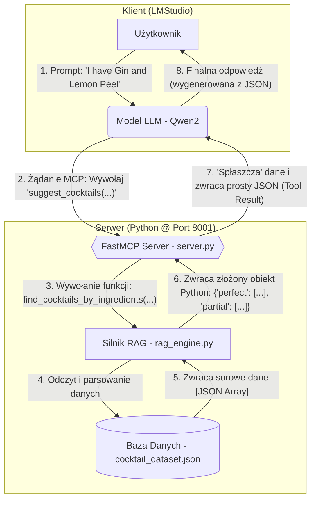
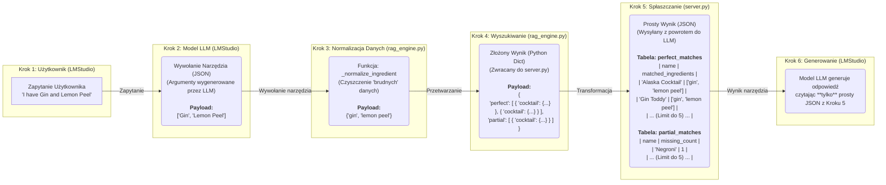

# 🍸 Asystent Koktajli RAG (FastMCP + LMStudio)

<p align="center">
  <strong>Zaawansowany system RAG (Retrieval-Augmented Generation) do serwowania precyzyjnych przepisów na koktajle dla modeli LLM.</strong>
</p>

<p align="center">
<a href="https://github.com/modelcontext/fastmcp">
    
</a>
<a href="https://lmstudio.ai/">
    
</a>
<a href="https://www.python.org/">
    
</a>
</p>

## 1. O Projekcie

Ten projekt to implementacja architektury **RAG (Retrieval-Augmented Generation)**. Jego celem jest stworzenie zewnętrznego systemu "narzędzi" (tools), który łączy model językowy (LLM) z dedykowaną, statyczną bazą wiedzy.

Zamiast polegać na ogólnej, wewnętrznej wiedzy modelu, system ten zapewnia, że odpowiedzi są **weryfikowalne** i **oparte na faktach** z dostarczonego zbioru danych.

Projekt ten demonstruje:
* Implementację serwera **MCP (Model Context Protocol)** przy użyciu **FastMCP**.
* Budowę niestandardowego silnika wyszukiwania (retrievera) w Pythonie, zdolnego do obsługi niekonsekwentnych danych.
* Integrację serwera RAG z klientem **LMStudio**, aby udostępnić modelowi LLM (np. `qwen2`) nowe, dynamiczne możliwości.

<br>

## 2. Kluczowe Technologie (Wyjaśnienie Koncepcji)

Zanim przejdziemy do architektury, warto wyjaśnić trzy kluczowe technologie, na których opiera się ten projekt.

### 🧠 Czym jest RAG (Retrieval-Augmented Generation)?

**RAG** to skrót od **Retrieval-Augmented Generation**, co można przetłumaczyć jako "Generowanie Wzbogacone o Wyszukiwanie".

* **Problem:** Modele LLM (jak Qwen2 czy Llama) często "halucynują" lub zmyślają odpowiedzi, gdy nie znają faktów. Ich wiedza jest ograniczona do danych, na których je trenowano.
* **Rozwiązanie (RAG):** Zamiast polegać na pamięci modelu, RAG daje mu "podręcznik" (w naszym przypadku plik `cocktail_dataset.json`) i każe mu z niego korzystać za każdym razem, gdy odpowiada na pytanie.

To działa jak **egzamin z otwartą książką**:
1.  **Retrieval (Wyszukiwanie):** Użytkownik pyta o przepis. Nasz kod (`rag_engine.py`) najpierw **wyszukuje** (pobiera) prawdziwy przepis z naszego pliku JSON.
2.  **Augmentation (Wzbogacanie):** System "wzbogaca" kontekst modelu, dodając do jego polecenia znaleziony przepis.
3.  **Generation (Generowanie):** Model LLM dostaje proste polecenie: "Na podstawie *tych* danych, które ci dałem, wygeneruj ładną odpowiedź dla użytkownika".

Dzięki temu model nie zmyśla, lecz opiera się na faktach.

### 📞 Czym jest MCP (Model Context Protocol)?

**MCP** to "język" lub "linia telefoniczna", która pozwala modelowi LLM rozmawiać z naszym kodem w Pythonie.

* **Problem:** Model LLM (działający w LMStudio) i nasz silnik wyszukiwania (`rag_engine.py`) to dwa oddzielne programy. Muszą mieć sposób, by się ze sobą komunikować.
* **Rozwiązanie (MCP):** MCP to protokół, który standaryzuje tę komunikację.
    * Nasz `server.py` (napisany przy użyciu **FastMCP**) działa jak "kuchnia" lub centrala telefoniczna, która czeka na zamówienia na porcie 8001.
    * Gdy model LLM chce coś znaleźć, używa MCP, by "zadzwonić" do naszego serwera i złożyć "zamówienie" (np. "proszę, użyj narzędzia `get_cocktail_recipe` dla 'Mojito'").
    * Nasz serwer odbiera to, uruchamia `rag_engine.py` i odsyła dane.

### 🖥️ Czym jest LMStudio?

**LMStudio** to darmowa aplikacja na komputery stacjonarne, która pozwala każdemu pobierać i uruchamiać potężne modele LLM (jak te od Mety, Google czy Mistral) lokalnie, na własnym komputerze.

W naszym projekcie LMStudio pełni **dwie kluczowe role**:
1.  **Host Modelu:** Jest "domem" dla modelu LLM (np. `qwen2`), który jest "mózgiem" całej operacji.
2.  **Klient MCP:** Działa jako "telefon", który używa protokołu MCP do łączenia się z serwerem i korzystania z narzędzi, które mu udostępniliśmy.

<br >

## 3. Architektura Systemu (Diagram Przepływu)

Poniższy diagram ilustruje, jak informacja przepływa przez system, od zapytania użytkownika do finalnej odpowiedzi.





```json
{
  "ingredients": ["Gin", "Lemon Peel"]
}
